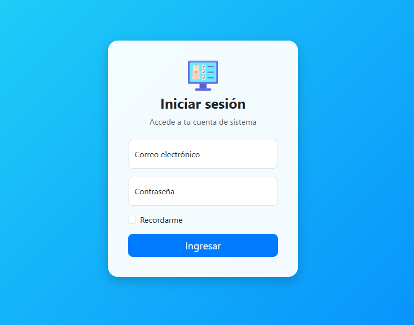
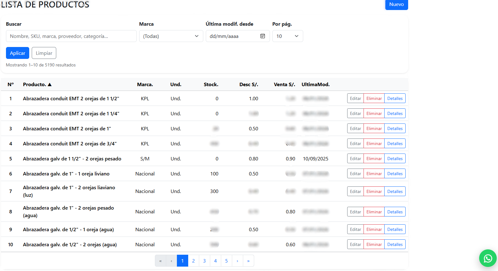

# 🏪 Sistema Web FECOM

Sistema web desarrollado para la gestión de ventas e inventario de la ferretería **FECOM**, orientado a optimizar los procesos de negocio mediante una plataforma moderna y eficiente.

---

# 🚀 Características

✅ Gestión de productos  
✅ Control de inventario  
✅ Registro de ventas  
✅ Facturación con IGV  
✅ Gestión de clientes  
✅ Reportes básicos  
✅ Interfaz moderna y responsive  

---

# 🛠️ Tecnologías Utilizadas

<p align="center">
  
</p>

- ASP.NET Core MVC
- C#
- Entity Framework Core
- SQL Server
- Bootstrap
- HTML5
- CSS3
- JavaScript

---

# 📸 Capturas del Sistema

## 🔐 Login


---

## 📦 Gestión de Productos



---

# ⚙️ Funcionalidades

## 📦 Módulo de Productos
- Registrar productos
- Editar productos
- Eliminar productos
- Control de stock

## 👥 Módulo de Clientes
- Registro de clientes
- Búsqueda de clientes

## 🛒 Módulo de Ventas
- Registro de ventas
- Cálculo automático de IGV
- Generación de facturas

## 📊 Reportes
- Historial de ventas
- Reportes básicos de inventario

---

# 🗄️ Base de Datos

El sistema utiliza **SQL Server** como motor de base de datos.

## Entidades principales:
- Productos
- Clientes
- Ventas
- DetalleVentas
- Facturas

---

# 🧩 Arquitectura

El proyecto fue desarrollado utilizando el patrón:

- MVC (Model - View - Controller)

Implementando:
- Entity Framework Core
- LINQ
- Migraciones
- Buenas prácticas de desarrollo

---

# ▶️ Cómo ejecutar el proyecto

## 1️⃣ Clonar repositorio

```bash
git clone https://github.com/josephblancoromero/VENTAS-SISTEMA.git
```

---

## 2️⃣ Abrir proyecto

Abrir en:
- Visual Studio 2022

---

## 3️⃣ Configurar cadena de conexión

Editar el archivo:

```txt
appsettings.json
```

Configurar:

```json
"ConnectionStrings": {
  "DefaultConnection": "Server=TU_SERVIDOR;Database=FECOMDB;Trusted_Connection=True;TrustServerCertificate=True;"
}
```

---

## 4️⃣ Ejecutar migraciones

```bash
Update-Database
```

---

## 5️⃣ Ejecutar proyecto

Presionar:

```txt
F5
```

---

# 🎯 Objetivo del Proyecto

Este proyecto fue desarrollado con fines académicos y prácticos, buscando mejorar los procesos de gestión de ventas e inventario de la empresa FECOM mediante una solución web moderna.

---

# 👨‍💻 Autor

## Joseph Blanco Romero

🎓 Estudiante de Ingeniería de Sistemas  
💻 Desarrollador ASP.NET Core MVC  
📍 Huancayo, Perú

---

# 📫 Contacto

- GitHub:
https://github.com/josephblancoromero

---
